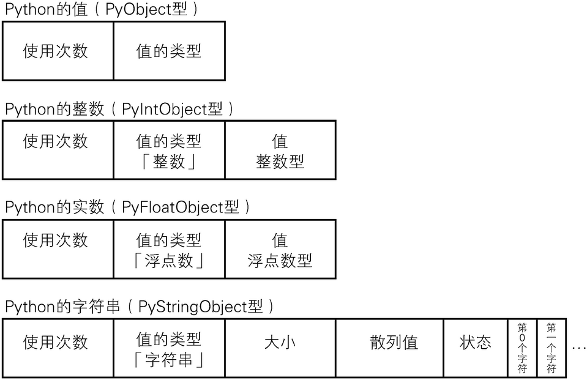
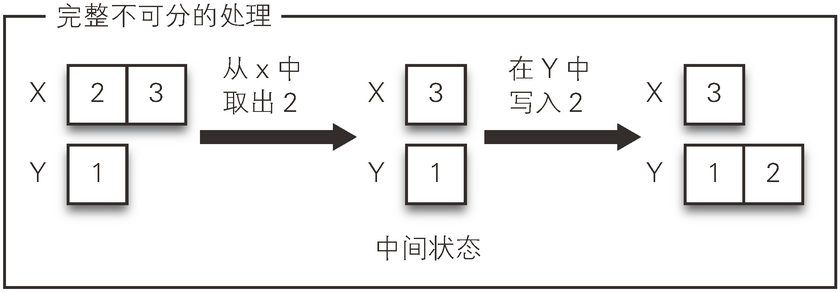
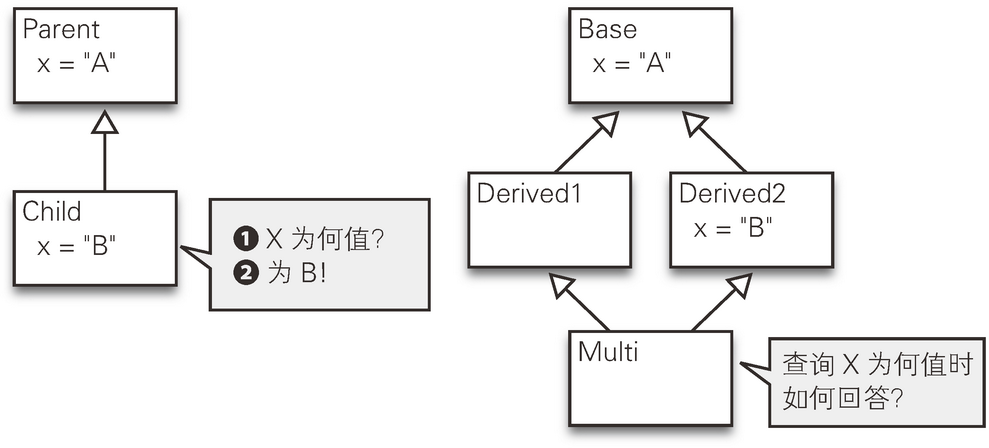
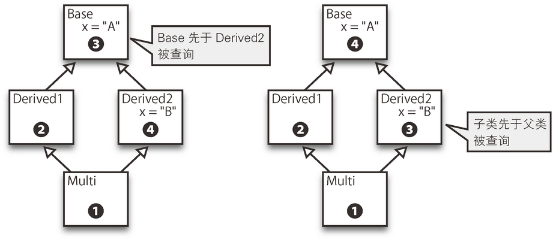
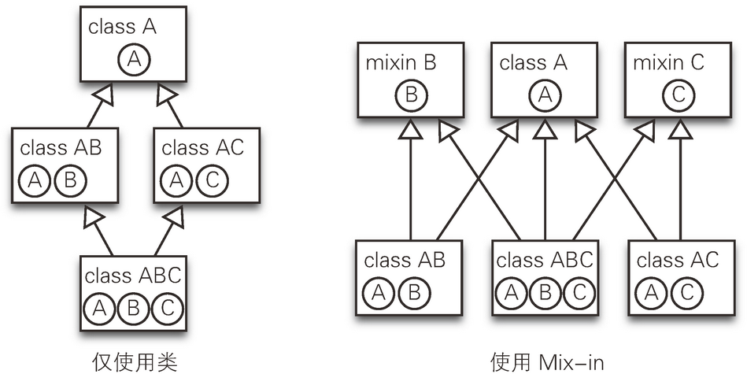

# 代码之髓

## 如何深入高效地学习语言

### 在比较中学习
语言不同，规则不同: Java 语言是有真假值这一数据类型的，在条件语句中必须使用这种类型。因为 0 为整型而不是真假值类型，如果在条件语句中用 0 作判断条件，就要发生编译错误。Python 语言中 0 为假，大小为 0 的容器也定义为假，所以空字符串与空的列表也为假。C 语言中用于处理字符串的 char* 即使指向的字符串为空也不为假，而当不指向任何值（值为 NULL）时便为假。


优秀的程序员具有三大美德： 懒惰、急躁和傲慢（Laziness, Impatience and Hubris）  
> Perl 语言的设计者 Larry Wall 在其著作 Programming Perl6 中提出

- 懒惰（Laziness）是一项为了减少总能量支出，而不遗余力地努力的素质。  
- “急躁”的意思是，程序员忍受不了程序执行的低效。  
- “傲慢”的意思是，程序员容不得对错误不管不顾。  

## 语法的诞生
### 什么是语法
语法是语言设计者制定的规则

### 栈机器和 FORTH 语言  
FORTH 语言不需要使用括号或者优先次序就可以表达计算顺序。
```
1 2 +       // 1+2
1 2 + 3 *   // (1+2)*3
2 3 * 1 +   // 2*3+1
```
很少再用 FORTH 这种基于栈的语言直接编写代码了。但是在一些不常见的场合仍然会看到它的身影。比如，Java、Python、Ruby 1.9 这些语言使用了栈机器型的 VM。VM 执行的命令行和 FORTH 语言是一样的。用 Python、Ruby 或 Java 等语言写出来的程序，在机器内部先被转换（编译）成像 FORTH 语言一样的程序，然后再运行。

### 语法树和 LISP 语言
LISP语言总是需要用括号标示完整的意思单元
```
(+ 1 2)     // 1+1
(* (+ 1 2) 3)  // (1+2)*3
```
把运算符放在运算对象之后、之前和之中的表示法分别称为后缀 表达式、前缀表达式、中缀表达式
> 前缀表达式和后缀表达式也被称为波兰表示法和逆波兰表示法，得名于最先研究它们的波兰人 Jan Lukasiewicz。前缀表达式中的括号并不是必需的，因为只要知道 + 和 * 取的是两个运算对象，即使省略了括号，表达式 * + 1 2 3 的含义也是可以理解的。LISP 语言中，有三个以上运算对象的情况也可以写成 (+ 1 2 3 4)。因为有了括号不会导致误解，省略括号是不行的。

### 语法分析器
语法分析器是把源代码作为字符串读入、解析，并建立语法树的程序。
python:通过 Python 语言自带的库文件 ast，我们可以查看特定的代码被转换成怎样的语法树  
```
import ast
ast.dump(ast.parse("1 + 2"))
ast.dump(ast.parse("(1 + 2) * 3"))
```
> ast 是 abstract syntax tree 的简写，意为抽象语法树。在语法复杂的语言中，语法树是包含很多细节的语法结构表达形式。把这种形式以更简洁的形式表达出来就是抽象语法树。
> http://www.ituring.com.cn/tupubarticle/4140

php parser
> https://github.com/nikic/PHP-Parser

## 程序的流程控制
### if语句的诞生
汇编语言中是没有 if 语句的，但是从 C 语言很容易就能编译成汇编语言。接下来，我们用 C 语言先编写带 if 语句的代码，再试着将其编译成汇编语言看一下  
C 语言下的源代码如下所示，其含义是如果 X 等于 456 则做相应 处理。
> 2实际实验的代码里，通过使用 __asm__ 在汇编语言里嵌入了注释。这里为了简洁易读做了改写。请参照本书文前的“本书构成”部分获取可执行的源代码。
```
C语言
int main(){
    int x = 123;
    /* if语句前 */
    if(x == 456){
        /* if语句中 */
    }
    /* if语句后 */
}
```
编译后输出如下汇编语言代码。

 汇编语言
 ```
_main:
        ……
        movl    $123, -8(%rbp)   ❶
        # if语句前             ¯├-❷
        movl    -8(%rbp), %eax_│
        cmpl    $456, %eax    
        jne     LBB1_2           ❸
        # if语句中                ❹
LBB1_2:                          ❺
        # if语句后
        ……
 ```
解读：首先，把 -8(%rbp) 理解为原来代码中的 x。❶句把数值 123 代入 x，❷句将 x 的值移存到临时场所后，把它和数值 456 相比较。

接下来的❸句是关键，它表示在前一句的比较中，如果两边不相等则跳转至 LBB1_2 处。换句话说，如果两边相等则不跳转接着执行下面的命令。❹句就是 if 语句中的代码，它只在两边相等时被执行。不相等时程序跳转至 LBB1_2（即❺句处），❹句不被执行 。
>这几个命令的意思分别是：movl=move long integer，cmpl=compare long integer，jne=jump if not equal。

这种满足条件后跳转的命令很早就有。比如 1949 年发明的 EDSAC 就 有“特定内存值大于零时跳转”和“特定内存值为负时跳转”这两条命令。
> 准确来讲，不是内存而是累加器（accumulator）。本书把内存一词理解为记忆装置并用在全书中。

C 语言中，如果使用跳转至指定行的命令 goto 语句实现else效果
```
C 语言
void not_use_if(int x){
 if(x <= 0) goto NOT_POSITIVE;
 printf("正数\n");
 goto END;
NOT_POSITIVE:
 if(x >= 0) goto NOT_NEGATIVE;
 printf("负数\n");
 goto END;
NOT_NEGATIVE:
 printf("零\n");
END:
 return;
}
```

### while 语句——让反复执行的 if 语句更简洁
使用 while 语句的表达方式
```
C语言
void use_while(int x){
   printf("use_while\n");
   while(x > 0){
       printf("%d\n", x);
       x--;
   }
}
```
不使用 while 语句的表达方式
```
C语言
void not_use_while(int x){
 printf("not_use_while\n");
START_LOOP:
 if(!(x > 0)) goto END_LOOP;
 printf("%d\n", x);
 x--;
 goto START_LOOP;
END_LOOP:
 return;
}
```
很多语言定义了用于中断循环的 break 语句，执行 break 语句后立刻从循环中跳出。这个动作和 goto END_LOOP 是一样的。

goto 语句是很强大也很容易理解的概念，但是过于原始。如果随意使用 goto 语句，程序将彻底散了架。再好的马，不配上缰绳也不能为人们所用，goto 语句的使用也需要加以限制，这样才便于代码的理解。if...else、while、break，这些就是加以限制了的 goto 语句

### for 语句——让数值渐增的 while 语句更简洁

### foreach——根据处理的对象来控制循环操作
在 Perl 语言中，for 和 foreach 为同义词，为了方便阅读，两者在语言中都有提供。  
Python 语言的 for 语句就是 foreach，它反而没有相当于Ｃ语言里功能的 for 语句。  
while 语句通过条件判断来控制循环操作，for 语句通过循环次数来控制循环操作，而 foreach 句型则是通过处理的对象来控制循环操作。

> 准确来讲，for 语句也是通过条件判断来控制的，但它主要体现的还是对循环次数的跟踪。

在没有 foreach 语句的 C 语言里，for 语句常常被用来实现对数组里各元素的处理操作。foreach 的句型的产生，就是为了方便编写对某对象内所有元素进行某种处理的代码。
```
 Java
// 数组
int[] items = new int[]{1, 2, 3, 4, 5};

// 用一般的for语句输出各元素
for(int i = 0; i < items.length; i++){
    int item = items[i];
    System.out.println(item);
}

// 用扩展的for语句输出各元素
for(int item: items){
    System.out.println(item);
}
```

## 函数
### 函数的作用
函数，即把代码的一部分视作有机整体，然后切分出来并为之命名的程序设计机制 <sup>1</sup>。便于再利用如同零部件

> <sup>1</sup>这种机制在不同时期和不同语言中，有事务、程序（procedure)、子程序（subroutine）等不同的叫法。但大多数人都习惯称它为“函数”。另外，类似的机制还有方法（method）,这里我们为简单起见，将函数和方法等同视之。

栈具体是怎么实现的呢？首先，决定记录栈顶位置（即最后被存入的数据的地址）的内存地址。之后每当存入新数据时将按步骤执行，值加1后把数据存入该数值指向的地址。

## 错误处理
函数调用时参数不足的情况：多数语言都会抛出异常，但是 JavaScript 语言会把缺失的参数当作未定义的特殊值（undefined）继续执行。

### 何时抛出异常
出错后就要立刻抛出异常,发生错误应该停止操作立刻报告，这一设计思想被称为错误优先（fail first）  
程序也会出错以及程序出错后是如何传达错误的。错误传达方法大致有两种，通过返回值传达和出错后跳转。
> http://www.ituring.com.cn/tupubarticle/4143

## 专栏
学习讲求细嚼慢咽。复杂的系统和不习惯的领域，我们也不可能一下子理解通透。首先要把信息切分，一小块一小块地消化吸收到自己的大脑里。  
在庞大信息量面前心力交瘁的时候。这时有三种战略可供参考：从需要的地方开始阅读，先掌握概要再阅读细节，从头开始逐章手抄。  
1. 从需要的地方开始阅读，有时，我们并不需要掌握一本书或者文档的全部内容。明确阅读的目的并弄清楚为达成这一目的需要阅读哪些地方，就可以有针对性地阅读，无需在其他无关的地方花费大量精力。
   或许有些人会因为不逐字逐句仔细阅读而产生负罪感。但是比起心力交瘁完全读不下去来说，还是挑挑拣拣地阅读更好吧。

## 名字和作用域
### 为什么要取名
名字比用变好的方式更易于理解。如：变量名和域名比内存地址和ip更易于理解。

## 名字冲突
### 如何避免冲突
取更长的变量名、使用作用域

## 作用域的演变
作用域是指名字的有效范围

### 动态作用域
perl中把变量声明为 local 就可以让程序处理器去承担“把原来的值另存起来随后返回  
使用动态作用域定义局部变量 x，要执行以下三个操作。
- 进入函数A时，准备新的对照表。
- 函数A写入变量 x 的值记录在该对照表中。
- 退出函数A时，作废该张对照表。

### 静态作用域
动态作用域中创建的对照表可以被全体的源代码读写，这是和静态作用域的一点很大的区别。

静态作用域按函数区分对照表  
多个函数共用一张对照表，这是动态作用域的问题点。那就按函数来区分对照表吧。此时程序执行以下三个操作。
- 进入函数A时，准备函数A**专用的新的**对照表。
- 函数A写入变量 x 的值记录在该对照表中。
- 退出函数A时，作废该张对照表。

时至今日，很多语言都选择了使用静态作用域。  
> JavaScript 语言和 Perl 语言一样，把没有任何声明的变量视为全局作用域，把用 var 声明的变量视为静态作用域。
> 而 1991 年问世的 Python 语言和 1995 年问世的 Ruby 中，即使不带任何修饰的变量也被视为静态作用域。
> 在以后的程序设计中，我们应尽量避免使用全局对照表这种大家共用的空间，而去使用那些能把变更的影响范围减小的方式，写出便于理解的代码。

Python 语言的作用域的三个层次：局部的、全局的、内置的

> http://www.ituring.com.cn/tupubarticle/4144

## 动态类型
处理器把变量名、保存数值的内存地址、内存里的内容的类型三者作为一个整体来看待。
把类型的信息和数值看作整体的方式叫动态类型。作为其反义词，到目前为止介绍的类型机制都叫静态类型。  

动态类型在内存上使用了同等类型对待的设计方法。
比如 Python 语言中，不管是整数还是浮点数还是字符串，全部都作为 PyObject 对待，开始部分都是一样的（下图）。
另外在 PyObject 类型的结构中还预留了保存值的类型信息的地方。


### 优势与不足
能实现静态类型语言不能实现的灵活处理。运行时确定类型和改变类型成为可能。  
然而，它也有一些不足。静态类型语言在编译时确定类型，同时编译时也检查了类型的一致性。有了这种类型检查，在实际执行前，便能发现一部分 bug。这一点动态类型语言是无法做到的。

### 类型推断
既不放弃编译时的类型检查，也想尽量减少麻烦的类型声明，要实现这一要求就要用到计算机自动推论确定类型的方法。

## 专栏
先掌握概要再阅读细节
书和文档都会有目录。浏览一遍目录便可以了解大概构造了。然后便可以开始正文的跳跃式阅读了。不要逐字逐句地读，首先看副标题和粗体字强调的内容、图表及其标题。

阅读源代码时，首先要看一眼文件夹结构和文件名。然后开始粗略地通读文件内容，对定义了的函数和类，以及经常被调用到的函数的名称要扫一眼。

不管哪种方法，它们的共通点都是要先掌握概要再渐进式地追求细节，这是大的原则。

阅读源代码时的切入口不一样。其中一种是使用调试器中的逐步执行功能，按照执行的顺序以及调用的层次关系作为切入口去阅读的方法。它也是一样地，首先是大致掌握程序的整个处理流，然后逐渐深入到函数中的处理过程中。

用这种方法阅读，可能会有信息在脑子里过了一下又淡去了的感觉。这时就需要试一试我们的最后一种手段——从头开始逐章手抄

## 容器和字符串
把这种存放多个元素的东西称为容器。在不同的语言中，容器的名称不同，性质各异。

### 数组与链表
数组中的存放方式是数值按顺序排列存放的  
链表不要求在内存中按顺序存储，而是在内存中同时存放表示下一个数据存放位置的信息。  

### 链表的模式图

数组在内存中的存储方式是连续的，大前提就是要有连续的内存区域。而链表却没有这一要求，它可以使用零散细分的内存区域。与数组不一样，对于链表来说，这些零散的区域在内存中所处的位置并不太重要。

### 链表的长处与短处
链表的长处是插入元素的计算量为 O(1)，而对于数组是 O(n)。元素的删除同样如此。链表只需要修改表示下一个元素所在位置的信息，因此计算量为 O(1)。而对于数组则需要把删除元素之后的所有元素都挪位，因此计算量为 O(n)。  
另一方面，链表也有其短处，要获得第 n 个元素需要花费较长时间。  
而链表可以把各元素存放在喜欢的任何位置，因此无法使用该方法 获得第 n 个元素。比如要知道从 100 号位置开始的链表的第 10 个元素，首先要读取最前面的元素，找到下一个元素所在的位置，再读取下一个元素，然后再找到其下一个元素所在的位置，如此反复操作 10 次才可以得到第 10 个元素。这时，计算量是 O(n)。
> **大 O 表示法——简洁地表达计算时间和数据量之间的关系**

### 散列表
散列表使用以字符串为参数返回整数的散列函数，实现了字符串与值的对应。

### 树
树是一种数据结构。链表中用箭头连接了下一个值，而树用箭头连接了右边子树和左边子树两处 15。因为在制作图表时一般会习惯性地向下描绘，所以与其说是树不如说更像是树根。

> 15 树最上面的节点叫根，箭头的尾端叫父节点，尖端叫子节点。子节点最多两个的树被称为二叉树。一般的树也可能有三个以上的子节点。第 3 章中我们曾经讲到过结构树，本章讲的是二叉树。

事实上，万能的容器是不存在的。根据容器的使用目的、使用方式和操作类型的不同，最适宜的容器类型也会相应地变化。是想要节约内存、节约计算时间，还是两样都没有必要节约。没有绝对的正确答案，而是需要根据当时的状况仔细分析，寻求最佳平衡。

## 字符串
C、Pascal、Java、Ruby 和 Python 这五种语言中，只有 C 语言中的字符串不知道自身的长度。其他语言中的字符串都携带有表现自身长度的整数。可以说 C 语言中的字符串是最为原始的字符串。

用 NUL 字符表示字符串的终止  
为达到这一目的使用了一种表现字符串终止的特殊字符，这就 NUL 字符<sup>40</sup>。NUL 字符是一个与 0 对应的字符，在 C 语言代码中用`\0`表示。

> <sup>40</sup>ASCII 规定将 null character 简称为 NUL，换行（line feed）简称为 LF。为了避免与 C 语言中的 NULL 指针相混淆，本书中用 NUL 字符来表述。

## 小结
本章我们学习了一种能往其中放入多个元素的东西——容器。并且了解到因为在内存上存储数据的方式不一样，各种容器的性能也不同，没有一种容器在各方面都是最优的，而是优缺点兼具。多数语言都支持数组和链表两种容器。

另外，我们还学习了字符串和值的对应方式。它也会因为实现方式不同而具有各种优缺点。多数语言都支持散列表。

在本章后半部分我们一起探讨了一种可以放入任意多字符的东西——字符串。字符串也有很多种类。首先是何为字符的问题（字符集的差异），其次是如何用比特列来表示字符的问题（字符编码方式的差异），再次是如何有针对性能在内存中存储信息的问题（字符串的实现的差异）。多数语言都支持字符串，但方式绝对不是一样的。

## 并发处理
### 交替的两种方法
协作式多任务模式——在合适的节点交替

抢占式多任务模式——一定时间后进行交替  
所谓抢占就是指能够终止其他人的行为，这种方式和协作式多任务模式不同，它的显著特征在于，不需要被终止程序的协助就可以单方面强制终止它。

### 如何避免竞态条件
没有共享——进程和 actor 模型
#### actor 模型
在不共享内存的设计方针下，还有一个流派——actor 模型。

不修改——const、val、Immutable  
线程的协调——fibre、coroutine、green thread  
表示不便介入的标志——锁、mutex、semaphore  

### 锁的问题及对策
#### 陷入死锁

假设有 A 和 B 两个作业，它们都能修改 X 和 Y 两个变量。A 按照先锁住 X 再锁住 Y 的顺序上锁，B 按照先锁住 Y 再锁住 X 的顺序上锁，在某些时间点有可能会产生问题。比如在 A 锁住了 X 的同时 B 又锁住了 Y，双方都会等待对方释放解锁。

这一现象叫做死锁。为了避免这一问题，程序员就需要在程序的整体上注意上锁的顺序，不仅要把握应该对什么上锁，还要把握好按什么顺序去上锁。

#### 无法组合
另外，锁还有无法组合这一个问题。比如要从列表 X 中删除第一个值然后追加到另一个列表 Y 中，我们考虑下如何实现这个处理（图 10.1）。假设我们希望把整个处理作为一个完整不可分（原子性地）的过程执行。也就是说，在将从 X 删除的值到写入 Y 中的中间状态时，其他处理无法访问列表 X 和 Y。这种情况下该上什么样的锁呢？


图 10.1　完整不可分的处理

在线程安全的程序库中，程序员无需担心锁的控制方式，内部机制可以保证使用锁后删除操作或写入操作不会被中间介入 12。但这个锁无法保证将从 X 删除值往 Y 中写入时不会被中间介入。要防止中间介入，程序员必须用新的锁将这两个处理步骤包括起来，用 synchronized lock 把所有这些与 X 和 Y 读写相关的代码包括起来。这样就没能达到让程序员无需担心锁的控制方式的目的。那没有其他好方法了吗？

#### 事务内存
有一种叫做事务内存的方法可以解决这一问题 13。这种方法把数据库中事务的理念运用到内存上，做法是先试着执行，如果失败则回退到最初状态重新执行，如果成功则共享这一变更（图 10.2）。它不是直接修改 X 或 Y，而是临时性地创建了一个版本对其进行修改，将一个完整不可分的过程执行完毕后才反映出最终的成果。

### 小结
本章我们学习了并发处理这个重要概念。并发处理是长久以来人们一直为之烦恼的问题，至今也有很多人为之困扰。回顾历史，我们会发现，人们在共享→非共享→共享、协调→非协调→协调、硬件→软件→硬件这样两种对立观念中左右摇摆。不单看片面而是兼顾两面，在平衡中灵活运用或许才是最为重要的。

## 对象与类
归集变量与函数建立模型的方法  
模块、包

### 闭包
```
 JavaScript
function makeCounter(){
  var count = 0;
  function push(){
    count++;
    console.log(count);
  }
  return push;
}

c = makeCounter();
c();                //-> 1
c();                //-> 2
c();                //-> 3
```
为什么把这称为闭包？一个包含了自由变量的开放表达式，它和该自由变量的约束环境组合在一起后，实现了一种封闭的状态。

拿上面一段代码来讲，函数 push 使用了变量 count，然而该变量并不是在函数 push 中定义的。这种变量被称为自由变量。函数 push 就是一个包含了自由变量的开放函数。而函数 makeCounter 的对照表中为 0 的值和为 count 的名字结合在了一起。这种给值绑定一个名字的操作叫做（名字）约束。这样开放函数 push 和 makeCounter 的对照表组合配套之后，无需在这以外的作用域中寻找变量的定义，从而达到了某种完备的状态。通过这样表现出一种封闭的属性。

### 类
类的三大作用:  
1. 整合体的生成器  
2. 可行操作的功能说明  
3. 代码再利用的单位  

## 第 12 章　继承与代码再利用
### 继承的不同实现策略
继承的实现策略大体可以分为三种。

#### 一般化与专门化
第一种策略是在父类中实现那些一般化的功能，在子类中实现那些专门的个性化的功能

#### 共享部分的提取
第二种策略是从多个类中提取出共享部分作为父类

#### 差异实现
第三种策略认为继承之后仅实现有变更的那些属性会带来效率的提高

### 继承是把双刃剑
使用方法多意味着继承这种机制有很高的自由度。这和我们在第 4 章中接触到的 goto 语句有点类似。滥用 goto 语句可能造成代码理解困难，因此对其使用应加以限制。与此类似，对继承的使用也有相同的考虑，应该对其加以限制。尤其是第三种使用方法——继承已有的类并实现差异部分，这种编程风格会造成多层级的继承树，很容易导致代码理解困难。

### 里氏置换原则
只要父类能出现的地方子类就可以出现，而且替换成子类不会产生任何错误或异常。 

### 多重继承
多重继承对于实现方式再利用是一种非常便利的方法  

## 多重继承的问题——还是有冲突
### 禁止多重继承
#### 委托
委托（delegation）也叫做聚集（aggregation）或者咨询（consultation）
```
下面一段代码显示了一个使用委托的例子。

 Java
public class TestDelegate {
    public static void main(String[] args){
        new UseInheritance().useHello(); // -> hello!
        new UseDelegate().useHello();    // -> hello!
    }
}


class Hello{   ❶
    public void hello(){
        System.out.println("hello!");
    }
}

class UseInheritance extends Hello {   ❷
    public void useHello(){
        hello();                       ❸
    }
}

class UseDelegate {                    ❹
    Hello h = new Hello();             ❺
    public void useHello(){
        h.hello();                     ❻
    }
}
```
显示“hello ！”的方法 hello 为类 Hello 所持有（❶）。类 UseInheritance 通过继承类 Hello 自身也持有了方法 hello（❷）并加以使用（❸）。与之不同，类 UseDelegate 并没有继承类 Hello（❹），而是通过句❺持有了类 Hello 的对象。当有需要使用时通过句❻将需要的处理委托给该对象操作。

与从多个类中继承实现强耦合的方式相比，使用委托进行耦合的方式显然要更好一些。对于委托的使用，也不需要在源代码中写死，而是可以通过配置文件在合适的时候注入运行时中去。这个想法催生了依赖注入（Dependency Injection）的概念。

#### 接口
Java 语言中禁止了多重继承，但它也具备实现多重继承的功能。这就需要借助接口（interface）<sup>7</sup>。

> <sup>7</sup> Java 语言中类的继承用 extends，接口的继承用 implements 来区别表示。另外接口的继承也称为实现。

Java 语言中可以对名字相同但参数类型不同的方法进行重载。因此，准确来讲， 这里说的名字应该是签名。

### 解决方法 2：按顺序进行搜索
深度优先搜索法的问题

从类 Base 派生出两个类 Derived1 和 Derived2。又有一个类 Multi 从这两个类继承出来。这样产生的继承关系叫菱形继承。

方法是可以被重载（override）的。图 12.12 的左边的 Parent 中定义的 x 在 Child 中就被重载了。因此 Child 中的 x 值变成了重载后的值。那么图 12.12 右边的菱形继承中 Derived2 方法重载之后，Multi.x 的值应该是多少呢？

#### C3 线性化确定顺序

C3 线性化是于 1996 年提出来的一种算法 <sup>11</sup>，它对类进行编号以满足以下两个约束条件：

> <sup>11</sup>在 OOPSLA'96 的活动上，Kim Barrett 等人发表了题为“A Monotonic Superclass Linearization for Dylan”的演讲。
- 父类不比子类先被检查
- 如果是从多个类中继承下来则优先检查先书写的类



下面的代码反映了使用深度优先搜索法的 Python 2.1 和采用了 C3 线性化顺序的 Python 2.3 以后的版本之间程序行为的差别。
```
 Python 2.1
# 尽管在Derived2中对ｘ进行了重新定义
# 到Multi后又回到了原来的情况
class Base:
    x = 'A'

class Derived1(Base): pass

class Derived2(Base):
    x = 'B' # 重新定义

class Multi(Derived1, Derived2): pass # Derived1在左边

print Multi.x #-> 'A'
# ↑没有使用Derived2中的定义

 Python 2.3以上
# new-style class（继承自object，使用C3线性化）
# Derived2中定义的'B'被Multi继承下来了
class Base(object):
    x = 'A'

class Derived1(Base): pass

class Derived2(Base):
    x = 'B' # 重新定义

class Multi(Derived1, Derived2): pass

print Multi.x #->'B'
# ↑使用了Derived2中的定义
```

### 解决方法 3：混入式处理
菱形继承在使用了 Mix-in 之后就可以变形为非菱形继承。图 12.14 的左侧展示的是类 AB 从类 A 继承并添加了方法 B，类 AC 从类 A 继承并添加了方法 C，进而从类 AB 和类 AC 做多重继承得到了类 ABC。右侧展示的是通过从类 A 和做混入处理用的类 B、类 C 按实际需要继承得到类 AB、类 AC、类 ABC。这种方法不仅消除了菱形继承，而且继承树的深度也减少了一层。


### 解决方法 4：Trait

## 专栏

从头开始逐章手抄

针对面对庞大信息量心力交瘁时该怎么办的问题，我们在第 6 章“学习讲求细嚼慢咽”专栏中介绍了三种方法。第一种方法是“从需要的地方开始阅读”，第二种方法是“先掌握概要再阅读细节”（第8章）。当这两种方法都不奏效时，就要采用最后一招——从头开始逐章手抄。

当没有明确要做的事情或者想要了解的东西时，当简单浏览的内容过目即忘时，以这种学习状态，不管怎么学也无法获得真知。

因此，为了打基础抄写教科书吧。不学习光唉声叹气是徒劳无用的，不如什么也不多想估且先做知识的搬运工。

除此之外别无它法。笔者有一种比较喜欢的方法，按时间段来衡量学习效果，比如每隔 25 分钟看自己学到了多少。当然按学习量来衡量也是可以的。重要的是设定足以获得成就感的合适的学习间隔。

## 后记
